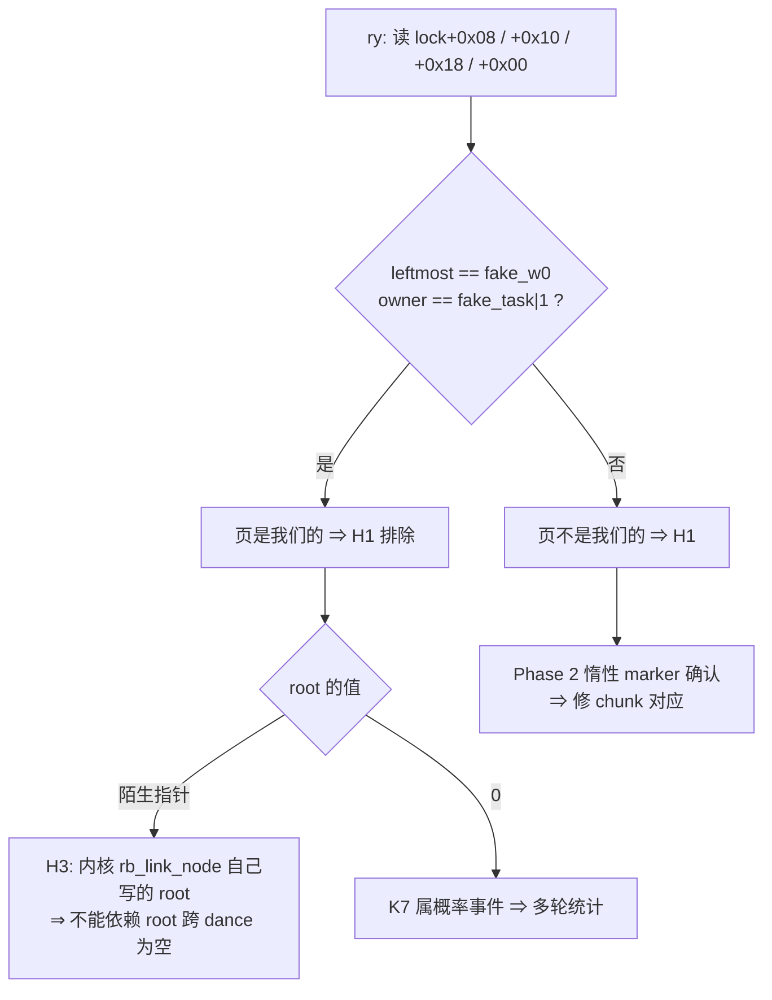

# payload 页身份确认 计划（2026-10-08）

## 现状与基线

- 分支 `diting-5.10`，HEAD `765b137`（另有一份未提交工作区，当前是 build N 形状，已判定为死路）。
  设备上装的是 build K（`GhostLock-K-rootnull.apk`，v567，20:20:48）。
- 已定事实：build K 连续 3 次落地 W1（`SELinux permissive` / `Write 1 complete`），其中两次达到
  W2 attempt 1。写载具确定为 tree entry 在 `rtmutex.c:663` 的 erase（case 1 "child is rb_left"，
  `*(target) = pc` 无条件）。
- 待解释的测量（run K7，20:46，`rx` 探针 `scripts/arm-probes-once.sh:120`）：

  ```
  rx: rt_mutex_adjust_prio_chain+0x520  root=0xffffff89ca022678  at=0xffffff89c5b10008
  ```

- 同 run 的自报地址：K7 的设备日志目录为空（`/sdcard/Download/ghostlock-debug-log/20261008-204627/`，
  freeze + 重启丢了未落盘的 FUSE 尾巴）。等价的一次完整 run（K4，20:36）日志本次补拉到
  `external/port/gate1/Klog-20261008-203642/`，给出该 run 的自报值：

  ```
  [spray] mm_struct leaked=0xffffff88747b92c0
  pselect route setup shift=-2 page=ffffff88747b8000 fake_lock=ffffff88747b8000
      fake_w0=ffffff88747b8300 fake_task=ffffff88747b8400
  ```

  `base = leaked & ~0x7fff`（`util.cpp:680`）与打印的 `page=`/`fake_lock=` 一致；泄漏对象在 slab 内
  偏移 `0x12c0 = 5 × 0x3c0`，正好落在 960 的 stride 上。
- `fake_lock = payload_base + LOCK_OFF`，而 `payload_base = base + SKB_DATA_DELTA`、`SKB_DATA_DELTA = -0xe80`、
  `kLockOffset = 0xe80`（`util.cpp:340-346`，`constants.hpp:14`，`target_constants.hpp:26`）
  ⇒ `fake_lock == base`，K7 的 `at == fake_lock + 8`。
  **所以 K7 里"地址对"不能当作"页内容是我们写的"的证据**：`lock` 指针本来就是我们在 payload 里种下的，
  walk 按定义就会读到我们选定的地址。能说明问题的只有该地址上的**值**。
- 因此 `root` 陌生有三种解释，此前只列了第一种：
  - **H1 交付错页**：buffer 的 `chunk + LOCK_OFF + 0x08` 没有落到 `base + 0x08`（两段 32 KiB chunk 的
    对应关系、`chunk_bias` / `SKB_DATA_DELTA`）。
  - **H2 写后被覆盖**：页是我们的，该字在 prepare 到 walk 之间被改。
  - **H3 内核自己写**：`rt_mutex_enqueue()` 在空树上 `rb_link_node`，把 `root` 设成
    `&waiter->tree_entry`（栈 waiter 地址）。`util.cpp:378-395` 的"树根必须为空"是**每次 dance 之前**
    成立，不是永远成立。

## 目标与约束

目标：判定 K7 的 `root` 属于 H1 / H2 / H3 中的哪一种，判据可复核、可写进门禁记录。

非目标（本批次不做）：

- 不改 payload 交付路径（`chunk_bias` / `SKB_DATA_DELTA` / 页回收时机）；
- 不改 page waiter 形状，不复用 build N 的 pi-entry 载具；
- 不动 reap / quarantine（Wall 2 残留另立计划）。

约束：payload 页里能被写入的字几乎都被 walk 读且被用于分支（`root`、`leftmost`、`owner`、`wait_lock`），
写它们就会改变控制流。因此**优先只读手段**，写手段只在只读判不了时启用。

## 改动清单

### Phase 1 — 只读指纹（无 fork 代码改动）

| 文件 | 改动 |
|---|---|
| `scripts/arm-probes-once.sh:120` 附近（本仓库，不受 fork 门禁约束） | 新增 `ry` 探针；`rx` 原样保留——新的 fetcharg 若解析失败不至于连累已有探针 |
| `scripts/arm-probes-once.sh:129` | `ry` 加进 comm filter 循环 |

```
p:ry rt_mutex_adjust_prio_chain+0x520 root=%x12 at=%x1 lmost=+0x8(%x1) owner=+0x10(%x1) wl=-0x8(%x1)
```

`+0x51c` 是 `ldr x12,[x1,#0x8]!`（pre-index 写回），所以在 `+0x520` 处 `x1 = lock + 8`；四个 fetcharg
正好读到 `lock+0x08 / +0x10 / +0x18 / +0x00` = `rb_node` / `rb_leftmost` / `owner` / `wait_lock`。
期望值同 run 可从 app 日志的 `fake_w0` / `fake_task` 直接取。事件数与 `rx` 相同，trace 体积不变。

判定表：

| `lmost` | `owner` | `root` | 结论 |
|---|---|---|---|
| `== fake_w0` | `== fake_task\|1` | 陌生 | 页是我们的 ⇒ H1 排除；`root` 是被覆盖/被内核填的（H2 或 H3） |
| `== fake_w0` | `== fake_task\|1` | `== 0` | 页是我们的且 `root` 就是 build K 写的 0 ⇒ K7 是概率性事件，需要多轮统计 |
| 陌生 | 陌生 | 陌生 | 页不是我们的 ⇒ H1 |
| 与 `fake_w0`/`fake_task` 差整整 `0x8000` | — | — | 两个 32 KiB chunk 的对应关系错位 ⇒ 改 `chunk_bias` / `SKB_DATA_DELTA` |



### Phase 2 — 惰性 marker（L 级，本计划一并申请；Phase 1 判不了才做）

原设想（`LOCK_OFF + 0x08` 写 `0xdeadbeefcafe0001`）**不采用**，两个理由：

1. 那是 walk 的分支字。marker 若真在，下一次 descent 立刻按非规范地址取数 → data abort → oops/重启；
   "崩了"虽是确认，但代价和歧义都更大，而且它会改变本次运行后续能观察到的现象。
2. 页内存在**完全不参与 walk 的空档**：`kLockOffset = 0x0e80`、`kFileOperationsOffset = 0x0f80`
   （`target_constants.hpp:26-33`），中间 `LOCK_OFF + 0x20 … LOCK_OFF + 0xF8` 无任何引用（`rt_mutex` 在
   5.10 上是 0x20 字节）。marker 放这里，控制流零扰动。

| 文件 | 改动 |
|---|---|
| `src/core/support/util.cpp:396` 之后 | 新增一行 `put64(p, kernel::LOCK_OFF + 0x80, 0xdeadbeefcafe0001ULL);` |

偏移换算（必须按 VA 算，不能按 buffer 偏移算）：buffer 偏移 X 落到 VA
`payload_base + X = base - 0xe80 + X`。marker 的 buffer 偏移 `LOCK_OFF + 0x80 = 0xf00`
⇒ VA `base + 0x80`，即 fake lock（`base + 0x00`..`+0x20`）与 fops 表（`base + 0x100`）之间
的空档。`ry` 处 `x1 = base + 8`，所以读回偏移是 `0x80 - 8 = 0x78`。

读回放在**新探针** `rz` 上（`mk=+0x78(%x1)`），不动已验过能注册的 `ry`：新增 fetcharg 若解析
失败只损失 `rz`。

同一套换算也复核了既有布局：`fake_w0 = base + 0x300`、`fake_task = base + 0x400` 与 app 日志
打印的 `fake_lock = base` 完全对上（见 Phase 1 结果），说明"buffer 偏移 ↔ VA"确为线性对应。

- 读回 marker ⇒ 映射成立、页在 walk 时刻仍是我们的 ⇒ `root` 的字是被改的（H2 或 H3）。
- 读回陌生值 ⇒ 交付给错了页（H1），此时改 `chunk_bias` / 校验两段 chunk 的对应。

Phase 2 落在攻击关键 payload 布局上，属 L 级：需先认可本计划再写代码；实现后按 AGENTS.md 跑
`tools/cmp_disasm.py`（8 函数）+ 真机门禁 + 门禁记录归档。

## 数据流/控制流差异

- Phase 1：只增加 trace 的读字，native 二进制与 payload 字节完全不变。
- Phase 2：payload 页多一个常数（页偏移 `0x0f00`），不改变任何被 walk 读到的字，不改变 erase 的写路径、
  写顺序与 `prepare → execute → disarm → destroy` 边界；攻击代码与资源准备/回收之间的机器码顺序不变。

## 兼容性与回滚

- Phase 1 回滚：`git checkout scripts/arm-probes-once.sh`（本仓库），并重新 push 到
  `/data/local/tmp/`。
- Phase 2 回滚：`git checkout src/core/support/util.cpp`——该行位于未提交工作区，还原即回到 build K
  的字节。
- 两阶段都不改 profile / wire 格式，不需要重新导入 `offsets.conf`。

## 验证矩阵

| 批次 | 命令 | 预期 |
|---|---|---|
| 0 | `adb push scripts/arm-probes-once.sh /data/local/tmp/`；root 终端执行 arm；主机起 `scripts/host-capture.sh <out>` | `armed:` 计数 +1，`ry` 注册成功；drain 实时（不是 EOF-on-idle） |
| 1 | 攻击前先起 `scripts/stream-attack-log.sh`；跑一次 build K | `ry` 行的 `at`/`root`/`lmost`/`owner` 与该 run 日志里的 `fake_w0`/`fake_task` 同 run 比对 |
| 2（条件） | 改 `util.cpp` → `make -C src ghostlock`（0 警告）→ `make -C src lint-tidy` → `tools/cmp_disasm.py` → 构建 APK → 同一套探针重跑 | `mk=deadbeefcafe0001` 出现（⇒ H2/H3）或为陌生值（⇒ H1） |
| 门禁 | AGENTS.md 攻击关键路径门槛 | 冷机、固定 CPU 对、单 route；日志按 `docs/analysis/device-gates/*.md` 归档 |

注：build K 之后的 run 都丢过设备端日志（freeze 重启丢 FUSE 尾巴，SIGKILL 也不落盘），
批次 1 起必须先用 `scripts/stream-attack-log.sh` 抓主机侧全量日志。

## Phase 1 结果（2026-10-08 21:12 运行，build K，证据 `external/port/gate1/phase1/`）

```
kt: lock=0xffffff885cb64090 waiter=0xffffffc0556ebc20 task=…925a9280
kr: lock=0xffffff8973ea1a90 waiter=0xffffffc055713c30            ← CVE 原语
ka: task=0xffffff89925aa500 orig_waiter=0xffffff8994150000 top=0x0
ew → ee → ry/rx  at=0xffffff8994150008  root=0xffffff898e47ab00 lmost=0x0 owner=0x0 wl=0x1
el × 59122 → walk 不返回（ak 只有 2 次）→ RCU stall → 重启
```

- **冻结机制已从"推断"变成"实测"**：`ew → ee → ry/rx → el ×59122 → 不返回`。descent 在
  `lock+0x08` 上进入一棵不属于我们的树，循环 59122 次直到 stall。此前说的"每次 dance 掷硬币"
  就是这个字是否为 0。
- 链上两把**真实**锁（`0xffffff885cb64090`、`0xffffff8973ea1a90`）都不是 `at-8`；`at-8 = 0xffffff8994150000`
  是 32 KiB 对齐、即 `leaked & ~0x7fff` 的形态 ⇒ walk 用的确实是我们种下的 fake lock。
- **指纹判据比设计时弱**（本计划的设计缺陷，据实记录）：
  - `lmost = 0` **不能**证明页不是我们的——`rbtree_augmented.h:312-313` 在 erase 时执行
    `root->rb_leftmost = rb_next(node)`，若被擦的是页 waiter（`pc = 1` ⇒ parent = NULL），
    `rb_next` 返回 NULL，`leftmost` 合法地变成 0。这是我们自己的设计产物。
  - `wl = 1` 只说明 walk 正持锁，两种情形都一样，无区分力。
  - 唯一且真正的异常是 `root = 0xffffff898e47ab00`：既不是页内值（应为 `0xffffff8994150…`），
    也不是内核可能写进 root 的节点指针（栈或本页）。K7 与本次两次运行各给一个不同的陌生
    root，且它正是随后让 descent 跑飞的字。`owner = 0`（应为我们写的 `fake_task|1`）同样待解释。
- **交付序列与可用参考一致**：`ghostlock-oneplus`（CPH2521，同 SoC 同 5.10.236）的
  `prepare_kernel_page` 尾部与 `util.cpp:690-770` 逐句对应（socketpair / SNDBUF / pcp_shaping
  sendmsg / 4×sched_yield / close pre-post-spray memfds / close pcp_shaping / close leak_memfd /
  `SKB_RECLAIM_SENDS` 循环 / reap burst），常量也相同（`SKB_DATA_DELTA = -0xe80`、
  `SKB_FRAG_BIAS = 0`）。所以不是"少做了一步回收"。
- 工具观察（下次运行前处理）：`ks` 与 `pd` 未加 comm filter，**全系统**触发；7.9 MB trace 里
  绝大部分是它们，属于已知的探针扰动源。

结论：单靠"读几个字"无法定案（dance 本身就会合法改写这些字）。**只有惰性 marker 能给出
非黑即白的答案** ⇒ Phase 2 是必要且充分的下一步。

## Phase 2 结果（2026-10-08 21:27 运行，build K2 = K + 惰性 marker）

```
rz: at=0xffffff8870478008 mk=0x0 root=0xffffff89dee68678
ry: root=0xffffff89dee68678 at=0xffffff8870478008 lmost=0x0 owner=0x0 wl=0x1
```

**`mk = 0`，不是 marker。** 该字（页偏移 `base+0x80`）不参与 dance 的任何读写，walk 不可能改写它——所以这不是"内核改写了我们的数据"，而是**我们写的字节从来不在那个页上**。

三条独立证据现在指向同一结论（H1，交付错页）：

1. `ry` 四个字全部不是我们的值（`root` 为陌生指针，`lmost`/`owner` 为 0，而 payload 写的是 `base+0x300` / `fake_task|1`）；
2. 惰性 marker 不在（`mk=0`）；
3. **源级复核**：`payload_write_layout_accepts_page`（`payload_builder.cpp:96`）只检查
   `(layout->right >> 16) & 1`——一个**由目标地址算出来的位**，从不读内核页。所以 app 打印的
   `prepare_kernel_page ok` 从未验证过页内容，`prepare_good_kernel_page` 的"ok"与页无关。

本次运行同样死在 descent 里（`ka → ew → ee → rz/ry/rx` 后静默，`el` 只有 2 次，`en`/`ei` 为 0）。

**与可用参考的逐项比对（已完成）**：常量（含 `SKB_DATA_DELTA = -0xe80`、`SKB_FRAG_BIAS = 0`）、
KernelSnitch 泄漏方式、`base = leaked & ~(ORDER3_SIZE - 1)`、以及 `prepare_kernel_page` 尾部
（socketpair / SNDBUF / pcp_shaping sendmsg / 4×sched_yield / close pre·post·spray memfds /
close pcp_shaping / close leak_memfd / `SKB_RECLAIM_SENDS` 循环 / reap burst）**逐句一致**。
⇒ 差异不在移植逻辑，而在本机行为。

**已排除：页分配器 shuffle。** 本内核世代 `mm/shuffle.c:14` 是 `static bool shuffle_param;`
（无 `IS_ENABLED(...)` 初值）⇒ 即使 `CONFIG_SHUFFLE_PAGE_ALLOCATOR=y`，默认也是**关**的（只由
`page_alloc.shuffle=` 或 root-only 的 sysfs 打开）；且 order-3 的释放/分配走 per-CPU 页表
（`PAGE_ALLOC_COSTLY_ORDER = 3`，`mmzone.h:40`），本就是 `pcp_shaping` 针对的路径。

## Phase 3 — 自定位 buffer（已实现，待装机）

现在有两个活着的假设，且**一次运行即可区分**：`SKB_DATA_DELTA`/`LOCK_OFF` 这组硬编码常量在本机
不成立（偏移错），或者那个页压根不是我们的（回收失败）。两者都能被"让 buffer 自己说明它去了哪"回答。

改动（`util.cpp`，`prepare_skb_payload`）：在每个 chunk 从不使用的两段
（`[0, LOCK_OFF)` 与 `[0x2000, ORDER3_SIZE)`）里，把每个 8 字节写成**自带 (chunk, 偏移) 的标签**
`0x7A5C000000000000 | (chunk << 32) | off`；payload 字段在该填充**之后**写入并覆盖自己的偏移，
所以 dance 看到的 payload 不变。marker 也带上 chunk 位（`0xdeadbeefcafe0000 | chunk`），
使"整体错开一个 chunk"直接可见。

读回（新探针 `r3`，同一 site，`x1 = base + 8`）：

| fetcharg | VA | 假想映射下的 buffer 偏移 |
|---|---|---|
| `t1=-0x808(%x1)` | `base - 0x800` | `0x680` |
| `t2=+0x1ff8(%x1)` | `base + 0x2000` | `0x2f00` |
| `mk=+0x78(%x1)` | `base + 0x80` | `0xf00`（payload 区 marker） |

判读：读回值是标签 ⇒ 低位直接就是"哪个 buffer 字节落在这个 VA"，即**真实的映射**（由它反算
`SKB_DATA_DELTA` 应该是多少）；读回值不是标签 ⇒ 该页不是我们的（回收/生命周期问题，回到
PCP/CPU 亲和与释放路径）。

门禁（K 基线 vs K3）：`make -C src ghostlock` 0 警告；`lint-tidy` exit 0；`cmp_disasm`
5 个 strict IDENTICAL，`do_one_write` 为 LAYOUT-SHIFT（唯一差异是 `[44] adrp x22, 0x42000`
的**符号注解**由 `write+0x42000` 变为 `kRouteSelect+0x18`，指令、寄存器、地址完全相同，
属已复核的注解差异；该分支不计失败），2 个 multicast worker 在两个二进制里都缺失（pre-existing）。

## Phase 3 结果（2026-10-08 21:47 运行，K3 = 自定位 buffer）

```
r3: at=0xffffff88a1510008  t1=0x64e203000008  t2=0x0  mk=0x0
rz: mk=0x0 root=0xffffff8846992590
ry: root=0xffffff8846992590 at=0xffffff88a1510008 lmost=0x0 owner=0x0 wl=0x1
ka=3, ak=2, el=1, en=0, ei=0   ← walk 死在 descent 里
```

**三个位置都不是标签。** 其中 `t1` 是决定性的：`0x64e203000008` 是**用户态地址**——payload 里
所有值都是内核地址，所以它既不是我们的标签、也不是我们的 payload 字。

关键推理：若 `base-0x800` 那一页属于我们，读回值**只能**来自我们的 buffer（标签区或 payload 区），
与偏移错多少无关。因此 **`base-0x800` 这一页肯定不是我们的**；`mk=0`（应为 marker）与它一致。
⇒ **小偏移（±0x2000 以内）这一族被关闭**：不是 `SKB_DATA_DELTA`/`chunk_bias` 差一点的问题。

（`t2=0` 单独看有歧义——0 既可能是外来零也可能是我们 payload 的零；`t1` 才是判据。
walk 侧也自证：`en`/`ei` 从未触发、`ak < ka`，即 descent 没走完就死了。）

**根因方向（本次收敛结论）**：`base`（KernelSnitch 泄漏的 mm_struct 地址按 32 KiB 对齐）所指的页
**从未成为我们的 skb frag 页**。所有"树状态是掷硬币"的现象——包括吃掉约 20 次运行的冻结——
都是这一个事实的症状：walk 用的是我们种的指针（`at = fake_lock + 8` 确实等于 base+8），
但那个地址上是别人的内容。

**环境转储丢失**：`/data/local/tmp/probe-env.txt` 拉回来是**全 0**（文件在、数据块没落盘——与
app 日志尾巴同因，硬冻结导致不回写）。下次改为写 `$TR/trace_marker`：主机 drain 会捕获，
且不受冻结影响。

## Option 1 — 追回收链（进行中，2026-10-08 22:0x）

目标：让被释放的 mm_struct slab 页真正成为 skb frag 页。已排除/已澄清：

- **CPU 亲和（已排除，用既有 trace）**：被 SIGKILL 的子进程 1214/1270 次退出发生在 CPU 004，
  与父进程（`kc`/`ds`/`kw` 全在 `[004]`）同核 ⇒ PCP 的"异核释放/分配不相遇"不成立。
- **`memfd` 真相（已澄清）**：`open_memfd()` 是 `open("/proc/<pid>/mem")`，持的是目标进程
  `mm_struct` 的 `mm_users` 引用（`util.cpp:255-259`）。对**活着的**子进程，close 不会释放 mm——
  mm 随进程退出才释放。所以设计是两段式：**先 kill（早），再把 fd 关在送包之前**（真正的释放点），
  让 free→alloc 相邻。本移植与该顺序一致（pre/post/spray 在 `util.cpp:620-628` 杀，
  memfd 在 `716-727` 关，leak fd 在 `738` 关——它是**最后**释放的，LIFO 下正是第一个被分配的页）。
- **参考实现并非"已验证可用"**：`ghostlock-oneplus/common.h:52` 是 `MM_STRUCT_SZ 0x500`（1280），
  对 5.10.236 是**错的**（真实 960）⇒ 它的 `mm_objs_per_slab` = 25，我们的是 34。所以"同样的代码在
  CPH2521 上能跑"这一前提站不住，不能再用它当"本机必然可行"的证据。

下一次运行（**不需要重新构建**：K3 已装，标签填充已在二进制里）：

- `r3` 扩成**扫描**：`mk` 之外再加 10 个点覆盖 `base ± 0x7000`（s16 fetcharg 上限内的整个
  ±32 KiB 窗口）。填充覆盖每个 chunk 约 94% 的字节，所以只要我们的 buffer 在这个窗口里，
  几乎必然会读到标签，**低位直接给出真实的 buffer 偏移**。三个位置全是外来值 ⇒ 问题不在"地址差一点"。
- 根权限环境事实（cmdline / shuffle / slabinfo）改写进 `$TR/trace_marker`——主机 drain 会捕获，
  且不受冻结影响（21:47 那次写文件拉回来全是 NUL：数据块没落盘）。

### Option 1 步骤 2：泄漏是真的，释放也是真的（run 22:00，trace6 + app-live6）

用新探针 `mm`（`mmput`，按 comm 过滤）把"我们实际释放了哪些 mm_struct"直接测了出来，再与 app 日志里
的 `mm_struct leaked=` 对比——**同一个 run 内比对，不依赖 walk 是否发生**：

| run 22:00 的泄漏值 | 页 | 是否出现在 mmput 集合里 |
|---|---|---|
| `0xffffff88bad43c00` | `0xffffff88bad40000` | **exact=YES**（偏移 0x3c00 = 16×960） |
| `0xffffff893288e900` | `0xffffff8932888000` | **exact=YES**（偏移 0x6900 = 28×960） |

进一步的时间线分析（无 filter 的逐毫秒聚类）：

- 被泄漏页的 **34 个对象在同一毫秒内被全部释放**（整页一次释放）⇒ 该 slab 完全属于我们的 spray，
  不是与别的进程混用 ⇒ **不是"slab 没被完全释放"**。
- 该页的释放发生在密集的 272 子进程 reap burst **之前约 385 ms**（232.046 s vs 232.43 s），
  即落在"早杀、送包前才关 fd"的那一组 ⇒ **释放时机正是设计想要的**（free 在 send 之前）。
- walk 时刻该页的内容仍是 mm_struct 字段（`mmap_base`/`start_stack`/`arg_start` 都是用户态地址）
  ⇒ 一个**已释放但从未被复用**的 slab。**修正**：此前把这份内容读成"用户页"是错的——mm_struct
  本身充满用户态地址。

⇒ 泄漏 ✓、释放 ✓、时机 ✓、整 slab ✓，**唯一剩下的嫌疑是分配侧：skb frag 分配没有取走这个已释放的页**。

一个具体缺口：第一次扫描覆盖到 `d = +0x7000`，而"整体上移一个 32 KiB chunk"（`+0x8000`）这一档的
标签区落在 `base + 0x7180 .. base + 0x8000`，**只差 0x180 字节没扫到**（s16 fetcharg 上限是 +0x7fff）。
`-0x8000` 那一档已被第一次扫描覆盖并排除（`d = -0x6000` 会读到 buffer 0x2e80，实测外来值）。
`r3` 现新增 `q1=+0x71f8`/`q2=+0x77f8` 两点补上 `+0x8000` 档（13 个 fetcharg 已验证可注册）。

（run 21:56/22:00 两次都死在 dance 之前，`r3` 未触发；读数需要一次走到 walk 的运行。）

### Option 1 步骤 3：直接观测 frag 分配取走了哪一页（run 22:05 之后）

**先纠正一个我自己的错误推理**：我加 `q1/q2` 是为了补"+0x8000 那一档没扫到"，但那是多余的——
marker 是**按 chunk 打标**的，两个 chunk 都会写入同一套 payload/marker 布局，所以只要 buffer 整体
上移或下移一个 chunk，`mk` 在 `base+0x80` 就会读到 `0xdeadbeefcafe0000/0001`，而不是 0。
实测 `mk=0` ⇒ **±1 chunk 早就被排除了**。至此所有偏移族都关闭。

（run 22:05：route 跑了——`kc` 171 次、一次 park——但 `kw` 只有 1 次、walk 完全没发生，
`r3/rz/ry` 全 0。读数需要一次真正触发 PI 链的运行。）

既然推断已到尽头，就直接测"分配侧拿了哪一页"：

- 新探针 `ap`（`__alloc_pages_nodemask` 入口，`gfp=%x0 order=%x1`）+ `apr`（返回，`page=$retval`）。
- 主机侧把 `struct page*` 换算成 phys → 直接映射 VA（`vmemmap = 0xfffffffe00000000`、
  `sizeof(struct page) = 64`、`PAGE_OFFSET = 0xffffff8000000000`，见 `target_constants.hpp`），
  再与同一 run 的 `base = leaked & ~0x7fff` 对比 ⇒ **直接看到 frag 页落在哪里**，
  而不是继续推断。若与 `base` 差若干 chunk，就按差值改指针算术；若取到的是完全无关的页，
  则说明这些释放的页根本没进到分配器手里（此时转 Option 2）。
- 过滤器必须写在 arm 脚本里（`events/kprobes/*/filter` 是 root-only，主机设不了）：
  `comm == "libghostlock.so" && order == 3`（`SKB_FRAG_PAGE_ORDER = get_order(32768) = 3`），
  否则是 firehose。注册与过滤已在设备上验证。

### Option 1 步骤 4：在 struct page 空间直接比对（run 22:07 之后）

run 22:07：walk 触发了一次，13 点扫描（含 `q1/q2`）**全部不是标签**、`mk=0`——buffer 确实不在
`base ± 32 KiB` 内，所有偏移族至此由实测关闭（不是推断）。

`ap`/`apr` 拿到 `struct page*`，但要换算成 VA 需要 PAGE_OFFSET/vmemmap 等常量（本机布局与我先前
的假设不符，值得单独查，但不该阻塞判断）。**改用不需要任何常量的做法**：新增探针
`fp`（`__free_pages` 入口，`page=%x0 order=%x1`，`comm && order == 3`），与 `apr` 的返回值在
**同一个 struct page 空间**直接比对：

- 若 frag 分配拿到的页**在**我们刚释放的页集合里 ⇒ 复用发生了，只是索引的位置不对
  ⇒ 按两者的**页序号差**修正指针算术（一个常量的事）。
- 若**从来不在** ⇒ 这些释放的页根本没回到分配器手里 ⇒ 触发 Option 2。

工具注记：`apr` 是返回探针，无法带 `order` 过滤 ⇒ 会带上我们进程所有 order-0 分配（run 22:07
实测 254,873 条、trace 39 MB）。分析时用相邻的 `ap`（带 order）配对；这是目前最大的单点扰动，
若下次 trace 过大就考虑改用 `skb_page_frag_refill` 的偏移探针替代。

> **Option 1 已关闭（2026-10-08 22:10）**：frag 路径只在我们释放集合里取到 3/160 次，
> order-3 与设计一致，扫描三 run 无标签 ⇒ LIFO 前提在本机不成立，非常量/时序可修。
> 触发条件已满足，方案已另行成文：**[`payload-page-option2-plan.md`](payload-page-option2-plan.md)**。
> 下面这节保留为当时的决策记录。

## Option 2 — 不依赖那一页（备用，**必须一直保留在视野里**）

用户 2026-10-08 明确：**先试 Option 1，但永远别忘 Option 2。**

思路：不再要求那一页属于我们，而是把 `fake_lock` 指向**内容可预测为零**的内核内存，
使 descent 不会跑飞（现在所有冻结都源于 walk 在别人的页上乱走）。

已确认的约束：我们唯一可控的内核内存是 pselect 压进 fd_set 的那 15 个字（waiter 占 13），
**放不下一个 lock（0x20+ 字节）** ⇒ Option 2 意味着**故意**指向不受控的内核内存（例如大块零 .bss）。
这比现状（已经在盲目写别人的页）更可控，但仍是一次有意的盲写，需要单独设计。

触发切换的条件：若 Option 1 的扫描显示"我们的 buffer 根本不在 `base` 附近"，且回收链的
机制性解释无法在设备上验证/修复，就转 Option 2。

## 明确保留

- build K 的 payload 形状（`LOCK_OFF+0x08 = 0`、page waiter pi arm、`pi_waiters` 全零）在 Phase 1 一字不动。
- `kernelsnitch/`、`LegacyProfileConverter.kt`、reap / quarantine 路径不动。
- 探针集合保持 lean：只加 `ry`，不复活 `ec` / `ri` / `re` / `rer` / `sp`（它们的扰动已在 2026-10-08 20:35
  那次运行中被证实会把 W2 窗口从 SIGKILL 变成内核 freeze）。

## 重建 build K 并验证（2026-10-08 21:20）

工作区当时是 **build N** 的形状（`select_stack_route.o` 时间戳 20:11:38 = N 的构建），而设备上装的是 K。
按会话记录恢复 K：route 表 words 2/3/4 = `{pc = fake_right, right = 0, left = target}`、5/6/7 = 0
（N 把同一组三元组挪到了 5/6/7，即写不出东西的那次）。

**重建正确性用字节证明**：不带 marker 重建后，`.text` 与设备上 `GhostLock-K-rootnull.apk` 里的
`libghostlock.so` **逐字节相同**（145,948 字节，`cmp` 无差异）。该未剥离符号的重建产物存为
`external/port/GhostLock-K-native-baseline`，作为后续 `cmp_disasm` 的基线（APK 内的 `.so` 是 stripped 的，
`base=False`，无法当基线用）。

门禁结果（K 基线 vs K+marker）：

| 门禁 | 结果 |
|---|---|
| `make -C src ghostlock` | 0 警告 |
| `make -C src lint-tidy` | exit 0 |
| `tools/cmp_disasm.py` | owner_thread / waiter_thread / consumer_thread / run_main_route_threads / do_kernel5_fake_lock_route / do_one_write 全部 **IDENTICAL (strict)**；`multicast_owner_worker` / `multicast_waiter_worker` 在**两个**二进制里都不存在（该 route 未为本 target 实例化，与本次改动无关，基线同样缺失） |
| marker 确实进入二进制 | `movk x11, #0xcafe, lsl #16` / `#0xbeef, lsl #32` / `#0xdead, lsl #48` @ `0x35bd8` |

新发现（upstream 候选）：`tools/cmp_disasm.py:96` 的 objdump 解析假设 NDK 布局是
`<ndk>/<version>/toolchains/...`（Google SDK 式），而 `env.sh`/SETUP.md 钉的 ONDK 把
`toolchains/` 直接放在根下 ⇒ 解析失败，必须显式设 `LLVM_OBJDUMP`。

## 进度

- [x] 现状与基线核对（补拉 K4 日志、`fake_lock == base` 推导、三种解释整理）
- [x] Phase 1 的 `ry` 写进 `scripts/arm-probes-once.sh` 并 push 到 `/data/local/tmp/`
- [x] Phase 1 运行（21:12）：判定"指纹判据弱于设计"，冻结机制实测为 runaway descent；
      证据归档 `external/port/gate1/phase1/`
- [x] Phase 2 代码改动 + 门禁（0 警告 / lint-tidy exit 0 / cmp_disasm 6/6 IDENTICAL strict）
- [x] `rz` 探针写入并 push（注册已验证）
- [x] 恢复 build K 形状并逐字节验证（`.text` 与出货 APK 相同）
- [x] Phase 2 装机（K2）并运行（21:27）：**`mk=0` ⇒ 交付错页确认**（H1）
- [x] 与可用参考逐项比对：常量/泄漏/base 推导/回收序列一致 ⇒ 不是移植逻辑问题
- [x] 排除页分配器 shuffle（默认关 + order-3 走 PCP）
- [x] Phase 3 实现 + 门禁（0 警告 / lint-tidy exit 0 / cmp_disasm 5 strict IDENTICAL + 1 已复核注解差异）
- [x] `r3` 探针写入并 push（注册已验证）
- [ ] **K3 装机（阻塞：设备锁屏，`INSTALL_FAILED_USER_RESTRICTED`；APK `external/port/GhostLock-K3-selflocate.apk`）**
- [ ] 跑一次，读 `r3` 的 `t1`/`t2`/`mk`：是标签 ⇒ 得真实映射，改 `SKB_DATA_DELTA`/`chunk_bias`；
      不是 ⇒ 页回收失败，转 PCP/CPU 亲和与释放路径
