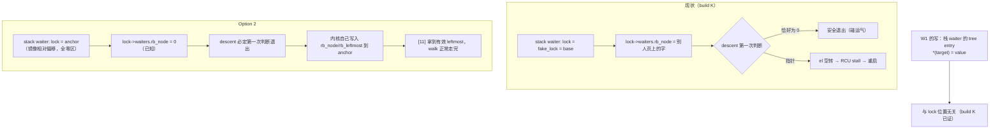

# Option 2：让 walk 不再依赖回收页（2026-10-08）

> 前置阅读：`docs/analysis/payload-page-identity-plan.md`（Option 1 的诊断全过程与结论）。
> 本计划是它记录的"用户明确要求一直保留"的备用路线，现在触发条件已满足。

## 现状与基线

Option 1 已由实测关闭（run 22:07/22:10，`external/port/gate1/phase1/trace9.log` 等）：

| 事实 | 证据 |
|---|---|
| KernelSnitch 泄漏是真的 | 泄漏值**精确出现**在我们 mmput 掉的 mm_struct 集合里（三个 attempt 全中） |
| 被泄漏的 slab 整页属于我们 | 该页 34 个对象在同一毫秒内全部释放 |
| 释放时机正确 | 落在"早杀、送包前才关 fd"那一组，是送包前最后一次释放 |
| 释放的页确实回到分配器 | 我们自己的 order-3 分配里 615/4029 拿到了刚释放的页 |
| skb frag 路径几乎拿不到我们的页 | `alloc_skb_with_frags` 160 次分配中只有 **3 次**来自我们的释放集合 |
| frag 的 order 与设计一致 | 160 次里 153 次紧邻一个 order-3 的 `ap`（中位 9 µs）⇒ 不是常量错 |
| payload 不在 `base` 附近 | 13 点扫描（±0x7000）三 run 全非标签，`mk=0` |

结论：**LIFO 复用前提在本机不成立**——本机页周转量远超 exploit 的 8 页足迹（同一窗口内我们自己的
进程就分配了 11.3 万个页表页 + 10.4 万个 vmalloc 页）。提高 `SKB_RECLAIM_SENDS` 需要上千次抽样才
可能命中某个特定页，而 socket 缓冲上限约 16 次。**这不是常量、时序或计数能修的。**

两个已经真机验证过的 build 给出了 Option 2 的依据：

- **build L**：树根为空时，内核自己的 erase 会 `root->rb_node = NULL`，**descent 在第一次判断就退出，
  与页内容无关** ⇒ 不会跑飞、不冻结。
- **build K**：W1 的写来自 **栈上** waiter 的 tree entry——`rb_set_parent_color(child, parent)`
  即 `*(target) = value`，**完全由节点自己的字驱动**，与 lock 在哪一页无关。

关键推导（本计划成立的前提，已按 5.10 源码复核）：把 lock 指向一块**全零**区域时，
`rb_leftmost = 0` 不会致死——[7] 的 `rb_erase_cached` 只在 `root->rb_leftmost == node` 时更新
（0 ≠ node，无操作），随后 `rt_mutex_enqueue` 在空根上立刻退出，并**由内核自己**
`rb_link_node` + `rb_insert_color_cached(..., leftmost = true)` 写入 `rb_node` 与 `rb_leftmost`。
（`util.cpp` 里"leftmost 必须预置有效指针"那条注释是针对 build K 的页 waiter 布局，不是本方案。）

## 目标与约束

目标：W1 在**不依赖回收页**的前提下稳定落地，且 walk 不再foreign 树上乱走。

- 判据：连续 5 次运行中 W1 落地、且无任何由 walk 引起的冻结/重启。
- 非目标：W2/W3（仍需页里的 fake task 与 cred 表，本方案不动）；不改泄漏/回收链路；
  不提高 reclaim 抽样数。
- 约束：
  - 目标地址必须**可写、内容为零、且没有任何读者/写者**（见"目标选择"）。
  - 目标必须在**内核镜像的相对偏移**上表达（KASLR；与 profile 里 `init_task`/`init_cred`
    等既有字段一致），不能写死绝对地址。
  - 写入的内核内存是**故意的**：约 0x20–0x40 字节（wait_lock 4 + rb_node 8 + rb_leftmost 8
    + owner 8，加上随后由内核写入的节点指针）。
  - 必须保留 build K 的写载具（栈 waiter 的 tree entry），不得回退到 pi-entry 载具（build N 已证明无效）。

## 改动清单

| 文件 | 改动 | 理由 |
|---|---|---|
| `app/src/main/assets/kernel_profiles/<uname-r>.conf` 与 `docs/kernel_profiles/PROFILE_SCHEMA.md` | 新增 `route.select_stack.lock_anchor_image`（u64，镜像相对偏移；缺省=不存在=旧行为） | 配置权威是 profile；新状态必须走 profile，不能写死代码 |
| `src/core/profile/model.h` + `profile/binary.cpp` + Kotlin route config 的 `entries()/apply()/from()` | 同步该字段（键名逐字一致） | Native↔Kotlin 双侧一致性（`route_catalog_test.cpp` / `RouteCatalogAgreementTest.kt` 会抓） |
| `src/core/route/select_stack_route.cpp` | 构造 waiter 时：若 `lock_anchor_image` 存在，则把 `lock` 那个字写成 `symbol_image(lock_anchor_image)` 而非 `fake_lock`；否则维持现状 | 只改一个被压进 fd_set 的字 |
| `src/core/support/util.cpp` | 该模式下不把 `LOCK_OFF` 区域当作 lock 使用（页仍照常准备，供 W2 与 fops/cred 表使用）；`LOCK_OFF+0x08/0x10/0x18` 的写入保持原样（无副作用） | 页的准备逻辑不动，降低回滚面 |

**目标选择 — 批次 A 结果（2026-10-08）**

选定 **`dump_skip.zeroes`，镜像偏移 `+0x2a3a590`，4096 字节**（`fs/coredump.c`）：

```c
int dump_skip(struct coredump_params *cprm, size_t nr)
{
	static char zeroes[PAGE_SIZE];
	...
			if (!dump_emit(cprm, zeroes, PAGE_SIZE))
```

- **从不被写**：全内核唯一引用是 `dump_emit(cprm, zeroes, ...)`（一次读），声明后从未赋值。
- **没有锁**：核心转储的跳过缓冲区不会被任何代码加锁 ⇒ 不可能与 walk 抢同一个字。
- **零、4 KiB、在 `.bss`**：落在 `[__bss_start, __bss_stop)` = `+0x298a000..+0x2a81c0c`；独立算出的
  大小恰为 `PAGE_SIZE`，与声明一致。
- **冷路径**：仅核心转储的 skip 路径可达（本机几乎不发生），且即便如此也只是读。
- **可写性静态成立**：`+0x2a3a590` 在 `.bss` 内且**大于** `__end_ro_after_init`（`+0x241f7f0`）
  ⇒ 就是普通可写 `.bss`，启动后未被改成只读。

选它的方法与排除理由（每个都花了检查）：

| 候选 | 排除理由 |
|---|---|
| `acf_pinner` / `lt_pinner`（各 ~192 KiB） | `struct longterm_pinner` 的**首字段是 spinlock**，且每次 long-term pin 都会写记录 ⇒ 与 walk 共享锁字 = 死锁 |
| `kfence_metadata` | 19 处引用全在活跃 KASAN 代码里 |
| `serial8250_ports` | `serial8250_init()` 启动时就把每个 port 初始化了 ⇒ 不是零 |
| `__log_buf` | printk 持续写入 |
| `drbg_algs` | **0 处代码引用 —— 而这个"0"什么都证明不了**：它是通过 *数据* 初始化器被引用的，文本扫描看不见 |
| `dax_host_list` | `LIST_HEAD` 自初始化 ⇒ 非零 |
| `empty_zero_page` / `init_cred` / `init_task` / `init_thread_union` | 全系统读 / 安全路径读 / idle 栈 |

方法学教训（写进记录）：交叉引用工具只扫**代码**中的 `adrp`+偏移，所以"引用数为 0"只是下界，
永远不能当作"没人用"；第一版还漏了确认低 12 位偏移，把同页的邻居符号也算成了引用。

## 数据流/控制流差异



不变量对照：

| 不变量 | 现状 | Option 2 |
|---|---|---|
| descent 的退出条件 | 取决于别人页上的一个字 | 取决于我们选定且验证过为零的字 |
| `rb_leftmost` | 页 waiter 地址（页内容可控时有效） | 由内核在 enqueue 时写入 |
| W1 写的来源 | 栈 waiter 的 tree entry | **不变** |
| 页的作用 | lock 内存 + fake task + 表 | 仅 fake task + 表（W2 起才需要） |
| 残留：`[7]` erase 的附带写 | 写进别人页（现状就有） | **同样存在**——见"明确保留"，本方案不消除它 |

## 兼容性与回滚

- 字段缺省 ⇒ 完全走今天的行为（一行分支），因此回滚 = 删掉 profile 字段，不需要改代码或重建。
- 若目标选择失败（找不到满足条件的区域），本方案作废、不落地任何代码；Option 1 的结论与
  `payload-page-identity-plan.md` 的记录不受影响。
- 不改 wire 版本号：新字段是**追加**，presence 由键是否出现表达（v2 语义允许）。

## 验证矩阵

| 批次 | 手段 | 通过标准 |
|---|---|---|
| A 目标选择 | 镜像符号表 + 交叉引用审计 | ✅ 完成：`dump_skip.zeroes` @ +0x2a3a590，见上 |
| B 可写性 | ~~一次性 LKM canary~~ → **静态判定** | ✅ 在 `.bss` 内且 > `__end_ro_after_init` ⇒ 可写。LKM 方案放弃：需要与运行内核完全匹配的 GKI 树 + `Module.symvers`（否则 vermagic/符号 CRC 拒绝），成本远超收益；而可写性的经验证据由批次 D 顺带给出 |
| C 运行期读取 | arm 脚本读 `/proc/kallsyms` 的 `_text` 算出 anchor 绝对地址，用 `@0x<addr>:x64` 注册两个探针：`kc`（`core_sys_select`，本进程每 run 约 171 次 ⇒ 采样器）与 `rz`（dance 现场） | `a0..a3` 全 run 恒为 0 ⇒ 确认零且无写者；dance 处 `a1`/`a2` 应变成我们的栈 waiter 地址（与 `kt`/`kr` 的 `waiter=` 交叉核对） |
| D 真机门禁 | 冷机、固定 CPU 对、单 route；连续 5 次运行 | W1 落地 ≥5/5，无 walk 引起的冻结/重启；`el` 无空转 |
| E 回归 | `cmp_disasm`（8 函数）+ `lint-tidy` + 零警告 | 攻击路径形状守恒（同批次需归档门禁记录） |

## 明确保留

- **不消除** `[7]` erase 的附带写：栈 waiter 的 tree entry 若带 `pc`/子节点指针，erase 的
  `__rb_change_child`/`rb_set_parent_color` 仍会写到那次 dance 指向的地址（今天也如此）。
  Option 2 只保证 **descent 不再取决于别人页上的字**，从而消除"跑飞→冻结"这一类死亡。
- 页准备（KernelSnitch/喷吐/回收）**一行不改**——W2/W3 仍需要它，Option 1 的全部结论继续有效。
- W2/W3 不在本方案范围内；它们的页依赖问题留在 `payload-page-identity-plan.md`。
- 现有探针集合（含 `r3`/`mk`/`mm`/`fp`）在批次 D 复用，`rz` 的 `mk` 仍可用于确认页是否偶然命中。

## 进度

- [x] 触发条件确认（Option 1 由实测关闭：frag 路径 3/160、order 一致、扫描无标签）
- [x] 关键推导复核（零 leftmost 是否致死 ⇒ 内核自己在 enqueue 时写入，不致死）
- [x] 批次 A：目标选择 + 交叉引用审计 ⇒ `dump_skip.zeroes` @ 镜像 +0x2a3a590
- [x] 批次 B：改为静态判定（`.bss` 内、> `__end_ro_after_init` ⇒ 可写），LKM 方案放弃并记录理由
- [x] 批次 C 设备侧就绪：`kc`（采样器）与 `rz`（dance）已带 `a0..a3` 绝对地址 fetcharg；
      注册已在设备上验证；剧本从 `_text` 现算地址（KASLR 自适配）
- [x] 批次 C 门禁（run 2026-10-08 22:37）：
      `env anchor: dump_skip.zeroes image+2a3a590 runtime=0xffffffdb13e3a590 [crosscheck OK]`
      —— 两个独立推导（按名字 / `_text`+偏移）一致，地址落在内核镜像区。`kc` 与 `rz` 两处读数
      `a0..a3 = 0`（含 descent 现场）⇒ 候选区真实、可读、且为**零**。
      **但 n=2 且两点都在同一秒（run 末尾）**，因此**还不能**声称"无写者"——这条必须靠采样密度，
      不能靠两点。
- [x] 采样加固：`ks`（`__sched_setscheduler`，每 run 数千次、覆盖全 run 与所有 CPU）加挂
      `a0..a3`，并**故意不加 comm filter** ⇒ 任何时刻任何非零读数都等于"有人在写这个区域"。
- [x] 采样加固后的读数（run 2026-10-08 22:41）：**8119 个 `ks` 样本全部 `a0..a3 = 0`**，
      覆盖 0.0007s→9.996s（喷吐最繁忙的一段，~800 样本/秒）；descent 处同样为零。
      同一次开机内 anchor 的运行时地址随 KASLR 变化（`0xffffffedf7c3a590`）而 crosscheck 依旧 OK
      ⇒ 解析机制跨启动稳定。
      残余保留：采样窗只覆盖 run 的 10s（共 ~100s），"从不被写"最终依据是源码审计（唯一引用是读）。
- [x] **设计前提成立** ⇒ 进入批次 D
- [ ] 顺带记录：本次 run 仍以冻结/重启结束（walk 在别人的页上跑飞）——这正是 Option 2 要消除的那一类死亡
- [x] 批次 D 实现（2026-10-08 22:48）：
      `route.select_stack.lock_anchor_image`（u64，镜像相对偏移，可选）已贯通
      `profile/model.h`（`RouteGeometry` + `SelectStackLayout` + 访问器）/ `profile/binary.cpp`（`OPT` 键）/
      `profile-core/.../route/SelectConfig.kt`（`entries()`/`apply()`，键名与顺序与 native 表一致——
      注意该文件的 `apply()` 是运行时的**唯一**映射，未处理的键会被静默丢弃）/
      `PROFILE_SCHEMA.md` + `PROFILE_SCHEMA_ZH.md`（同批次双语）/ 本机 profile。
      `select_stack_route.cpp` 在该字段存在时把 waiter 的 `lock` 字写成
      `addresses.data_alias(KIMAGE_TEXT_BASE + off)`，并 `pr_info` 打印解析结果（供主机核对）。
      字段缺省 ⇒ 与之前完全一致（旧行为即回滚点）。

      门禁：NDK 构建 0 警告；`lint-tidy` exit 0；`cmp_disasm` 与 K 基线相比 5 个 strict IDENTICAL +
      `do_one_write` 的既有注解差异（route 的 fdset 构造函数不在该门禁的 8 个函数内，故本改动对它不可见
      —— 因此额外用 `strings` 确认了新代码确实编入二进制）；Kotlin 单测 79/80 通过。
      **唯一失败的 `ProfileMigrationEquivalenceTest` 是既有问题**：assets 里有 61 个 6.x 内置 profile，
      而该测试的 fixture 断言数量为 55；`git status` 显示未触碰 `app/src/main/assets` 与 `app/src/test`
      ⇒ 来自上游同步的 fixture 漂移，与本次改动无关（记录在此以免日后误判为回归）。
### 批次 D 阻塞根因（2026-10-08 深夜）：字段从未进入 wire —— 已修

**症状**：profile 文档正确、已激活、应用已重启、合并也保留该键，但 native 侧完全没有反应。

**根因**：批次 D 的 Kotlin 侧改动只补了**编码**（`SelectConfig.entries()`）与**从 wire 解码**
（`apply()`），漏了**解析后的 ValueMap → 配置对象**这一步：`SelectConfig.from(value)` 逐个询问已知
路径，没有问 `lock_anchor_image` ⇒ 文档里的值在这里被静默丢弃，wire 里从来没有这个键，native 的
`OPT("lock_anchor_image", …)` 无事可做，路由继续用回收页。缺省即旧行为的设计让这个漏洞**不可见**：
profile 依然合法、导入成功、运行照跑。

**证据（三条独立）**：

1. **离线合并探针**（真文档 + 真 override 体，`ProfileMerger.resolveMerged`）：合并结果里键在，
   `route.select_stack = {lock_anchor_image=44279184, waiter_shift=-2, compact_waiter=1}` ⇒ 合并与
   HOCON 解析均无罪，丢弃点必在其后。
2. **设备侧 wire 字节直接解码**（`gate1/45-run1/applog/20261008-174812/profile.bin`，1972 B，真实内容）：
   `route.select_stack` 只有 4 项（`waiter_shift` / `compact_waiter` / `enter_delay_us` / `timeout_us`），
   **没有** `lock_anchor_image` —— 丢弃点在 wire 之前，实证。
3. **渲染长度差**：设备侧解析后 profile 的渲染尺寸 21:12 为 2281 B、22:52 起为 2314 B，
   **差 33 B = `    lock_anchor_image = 44279184\n` 的长度**（离线实测该行恰为 33 B）⇒ 解析后的
   profile **一直**带着这个键；丢失发生在"解析结果 → native 文档"这一步。

**修正一条早先的误判**：曾据 `profile.conf` "2314 B 逐字节相同"判断"生效 profile 从未变化"。
该结论不成立——本机 MediaStore 写出的调试旁文件**间歇性全 NUL**（尺寸正确、内容全 0；同一目录里
20 余个 `profile.conf`/`profile.bin`，有的 2283 B 全 0、有的 2283 B 内容完整）。全 0 文件的"逐字节
相同"毫无意义；真正有信号的是**尺寸**，而尺寸恰恰变了（+33）。**教训：尺寸可信，内容需先验非零**
（`python3 -c` 数非零字节即可）。此前的 wire 结论来自非零文件，仍然有效。

**修复**（纯 Kotlin，native `.so` 未变，故 `cmp_disasm` 不受影响）：

| 位置 | 改动 |
|---|---|
| `profile-core/.../route/SelectConfig.kt` | `from()` 增加 `lockAnchorImage = value("lock_anchor_image")?.toULong()`（真正的丢弃点） |
| `profile-core/.../profile/ProfileResolver.kt` | `nativeValue` 的 `branchField` 增加 `"lock_anchor_image" -> "lock_anchor_image"`（路由相对名解析，与 `compact_waiter` 同型） |

**回归守卫**（两种语言各一份，此为"系统性修复"的落点）：

- `app/src/test/.../SelectStackAnchorRoundTripTest.kt`：真链路
  `合并 → ProfileResolver → Profile → GLK1 字节 → 解码`，断言键到达文档且过 wire，并断言**缺省仍缺省**
  （不变成 0）。已验**非空转**：把 `from()` 的那行改回去，该测试在预期处失败。
- `src/core/tests/profile_binary_test.cpp`：新增按 wire 键名解码的用例 + 往返/缺省用例
  （host 端 `profile_binary_test` 通过）。

**门禁（2026-10-08 23:40）**：`make -C src ghostlock` 无原生改动（`.so` 与批次 D 相同）；
`lint-tidy` exit 0；Kotlin 单测 83 项，唯一失败仍是既有的 `ProfileMigrationEquivalenceTest`
（assets 61 个内置 profile vs fixture 断言 55）。APK `GhostLock-O2b-anchorfix.apk`（22,258,111 B）
已装机（23:40:52）。

**下一次真机运行的判据（改为不依赖绝对地址）**：

- app 日志 `blob=1998`（= 1972 + 26：键长 1 + 键名 17 + 值 8），`profile.bin` 亦应为 1998 B；
- app 日志出现 `[route] lock anchor: image +0x2a3a590 -> direct map 0x…`；
- trace 里 `rz`/`rx` 的 `at` == 脚本 env 行打印的 `expect at=0x…`（anchor+8），且 `root` == 同一次
  dance 中 `kt`/`kr` 的 `waiter=`（栈 waiter 地址）；
- `el` 不再空转、不再冻结；W1 仍落地（写载具未变）。

**探针脚本同步（`scripts/arm-probes-once.sh`）**：批次 C 用的绝对地址 fetcharg
（`a0=@0x<va>:x64`）**已全部移除**。它在 run 22:41 报 8119 个连续 0、run 23:0x 又返回**滚动垃圾**，
因此"0"与"读取失败"无法区分 —— 据此得出的"无写者"结论已撤回（脚本内注释与本节同步记录）。
门禁所需的全部信息改由**寄存器**给出（`rz.at`/`rz.root` + env 行的 `expect at=`），不再需要绝对地址。


## 进度（续）

- [x] 批次 D 代码修复 + 回归守卫 + 装机（见上节）
- [x] 批次 C 的绝对地址读取已从探针脚本移除，判据改为寄存器推导
- [ ] 批次 D 真机门禁：arm → 一次运行 → 按上节四条判据核对
- [ ] 批次 E：门禁归档（`cmp_disasm` 本次无原生改动，随时可跑）
